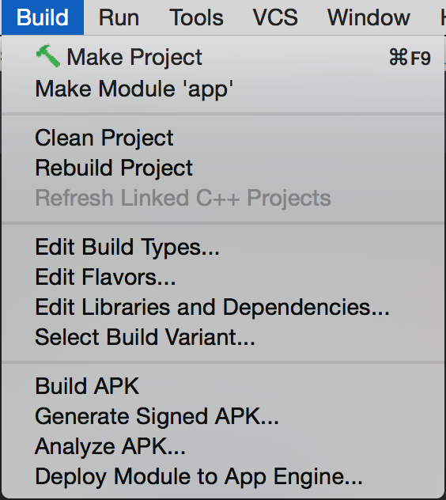

# Distribuir la aplicación

Para distribuir una aplicación primero hay que firmarla digitalmente con un tipo de compilación (normalmente release) y luego distribuirla de forma manual o mediante el Playstore.

## Firmando la aplicación en modo release:

Se puede utilizar Android Studio para manualmente generar APK's firmadas.

### 1 - En la barra de menu ir a: Build > Generate Signed APK.

### 2 - Seleccionar el modulo de aplicación.

Normalmente solo aparece uno: app

### 3 - Configurando el build

Al darle aceptar Le aparecerá un cartel como el siguiente:

Si ya se tiene un keystore entonces saltar el paso siguiente.

### 4 - Crear un Keystore

En la pantalla de generación de APK, darle click al boton: "Create New..." donde veremos una pantalla como la siguiente:

Key store path: Donde se creará el archivo llave.
Password: Crear y confirmar password para el keystore.

Key
- Alias: Un nombre para la llave
- Password: Crear y confirmar un password seguro para la llave. Este debe ser diferente al password del archivo keystore.
- Validity (years): Es la longitud en años que la llave debe ser valida. Esta longitud debe ser al menos de 25 años, de esta forma, se puden firmar las actualizaciones con la misma llave para el largo de toda la vida la app.
Certificate: Ingresar información sobre vos para el certificado. Esta informacion no esta mostrada en la aplicación, pero es incluido en el certificado como parte del APK.

### 5 - Utilizando el keystore para firmar el APK

Volvemos a encontrarnos con la imagen del apartado 2 donde debemos seleccionar el keystore e ingresar el keystore password, el correspondiente alias y el password del alias (si fue creado en el paso 3, entonces los campos se deberán llenar solos). Aquí tenemos la posibilidad de guardar el password para futuras actualizaciones.

### 6 - Seleccionar tipo de compilación

En la siguiente pantalla, podremos seleccionar donde se guardara el apk generado, el tipo de compilación (por omisión es RELEASE) y las distintas variantes (no cubiertas en este curso).

Finalmente le damos click a "Finish" y tenemos un APK firmado correctamente y del tipo de compilación es: *Release*

## Distribuir la aplicación generada:

Una vez generado el apk se puede distribuir de forma manual o mediante el Playstore.

### Liberando la aplicación de forma manual: Email

La forma mas fácil y rápida de liberar una aplicación es enviándola al usuario mediante un email. Para hacer esto, primero hay que compilar la aplicación firmada como hemos visto mas arriba y luego adjuntarla y enviarla al usuario vía email.

Cuando el usuario abra el email en su dispositivo Android, el mismo reconocerá la aplicación y mostrará la opcion de instalarla. El usuario puede instalar la aplicación simplemente tocando el botón instalar.

El sistema Android proteje a sus usuarios de instalar aplicaciones que no son del Google Play (el cual es de confianza). El sistema bloquea tales instalaciones, al menos que el usuario opte por aceptarlas mediante la configuracion: Settings > Security. Esta configuración permite la instalación de aplicaciones de otras fuentes distintas al Google Play.

### Publicando la app en Play Store

La publicación en el Play Store es muy sencilla y solo necesita de:

- Registrarse en una cuenta del tipo Google Play publisher.
- Configurar una cuenta Google payment merchant, si se quiere vender aplicaciones, o productos "in-app".

Registro de una cuenta "Publisher"

1. Visitar [Google Play Developer Console](https://play.google.com/apps/publish/)
2. Ingresar la información sobre tu identidad como desarrollador.
3. Leer y aceptar el acuerdo de distribución de desarrollador para el pais de tu locación.
4. Pagar 25usd para la registración mediante Google Payments. De no tener una cuenta Google Payments, se puede crear una con mucha facilidad.
5. Cuando el registro esta verificado, serás notificado mediante un email a la dirección de correo electrónico ingresado con anterioridad.

